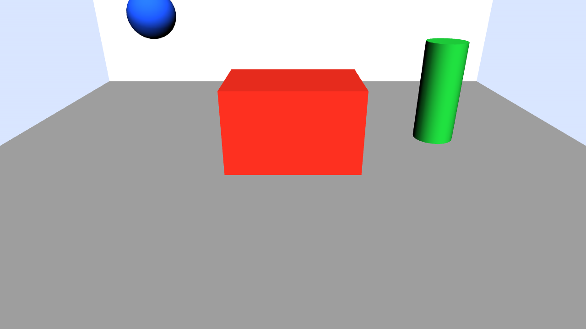
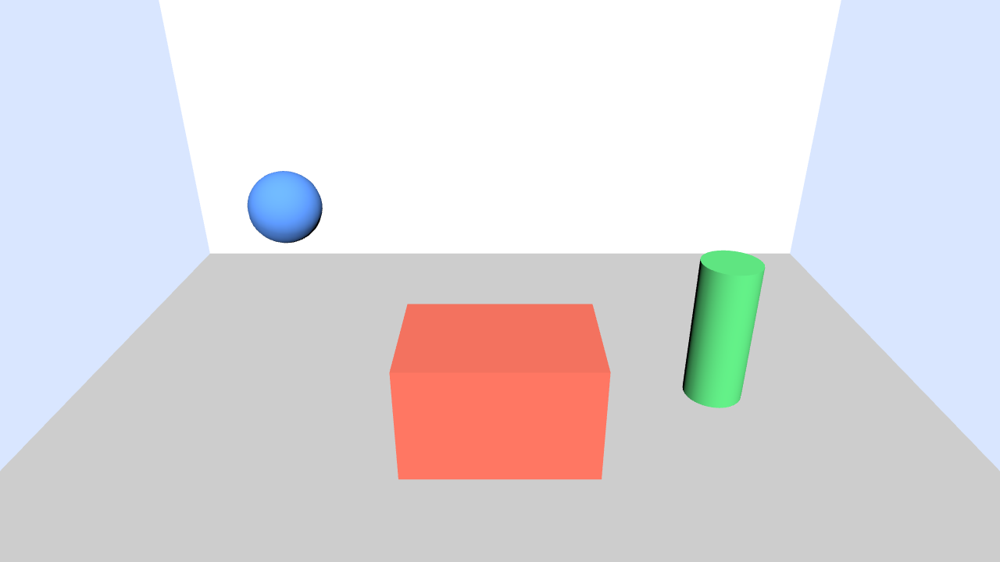

# x3d-perspective

**Take the user's perspective on an X3D scene.** `x3d-perspective` predicts the 2D view an X3D browser renders from a Viewpoint, captures the real view in X_ITE or X3DOM, and checks one against the other. It also turns viewer-relative instructions such as *"put that box to the right of the sphere"* into X3D field changes.

It is both a Python package with a command line, and an [Agent Skill](SKILL.md) that Claude can load. Every rule it applies comes from the X3D 4.1 specification: up and gravity, `avatarSize` and the WALK eye height, units and meter scale, projection, visibility and collision. [docs/X3D_MAPPINGS.md](docs/X3D_MAPPINGS.md) sets out each rule with its spec clause.

| X_ITE: WALK drops the `Overlook` eye to 1.6 m | X3DOM: keeps the authored 2.8 m until the user moves |
|---|---|
|  |  |

*The same Viewpoint in two renderers. The skill predicts both views: every coloured object lands within 3 px of its prediction, and the live camera within 1 cm of the predicted eye.*

## What it does

`x3d-perspective` is an agentic skill for taking the user's perspective on an X3D scene. It models the viewpoint the browser actually renders from: the currently bound Viewpoint, the currently bound NavigationInfo, the scene's unit scale, gravity and support, and the rectangular projection implied by the Viewpoint's `fieldOfView` and the current viewport aspect ratio.

- **Imagine the view.** For each object: where it lands in the frame, how large it appears, which edges cut it, how far away it is, whether it is hidden and by what, and a reason code if it is not visible.
- **Model the camera policy.** It distinguishes WALK, FLY, EXAMINE and other navigation modes. WALK is grounded and subject to gravity/support settling; FLY keeps a free-flight camera with persistent up; EXAMINE keeps an authored eye with a target-centered orbit policy.
- **Respect the bound runtime state.** The agent prefers the runtime-bound Viewpoint and NavigationInfo when known, while still using file-order defaults when a scene is static or not yet bound.
- **Respect projection geometry.** The skill computes horizontal and vertical FOV from the bound Viewpoint's `fieldOfView` and the current viewport size, using the X3D rectangular-projection rule: `width / height = tan(FOVhorizontal / 2) / tan(FOVvertical / 2)`.
- **Capture and see.** Drive X_ITE or X3DOM headless, bind Viewpoints, change fields in the live scene, read the live camera, and capture the canvas. Then compare the capture against the prediction.
- **Understand the frame.** Up, gravity, units, extent in meters, and the viewer's body. It also accounts for renderer-specific WALK settling behavior.
- **Relate and act from the viewer's position.** `right = level(view direction) × up`, so "right of the sphere" means +X from one Viewpoint and −Z from another. `place` returns the `translation` to set, in the object's parent frame.
- **Verify any scene.** `x3d-perspective verify` runs every Viewpoint in both renderers and exits with status 1 if the predictions and the renderers disagree.

## Schema contract and validation layer

The runtime engine is now paired with a formal schema layer in `x3d_perspective.schema`. It converts the runtime perspective reasoning into a machine-readable contract that can be validated and consumed by downstream authoring, scene planning, or agent workflows.

```python
import x3d_perspective as xp

scene = xp.load("room.x3d")
model = xp.build_perspective_model(scene, viewpoint="Entry", renderer="spec")
errors = xp.validate_perspective_model(model)

assert not errors
contract = xp.build_skill_contract()
taxonomy = xp.build_taxonomy_contract()
trace = xp.build_decision_trace(
    model_type=model.perspective_type,
    navigation_mode=model.navigation_mode,
    scene_context="museum",
)
```

The exported schema API includes:

- `PerspectiveModel` and `SkillContract`
- `build_perspective_model(scene, viewpoint=None, renderer="spec")`
- `validate_perspective_model(model)`
- `build_taxonomy_contract()`
- `build_environment_rule_table()`
- `build_observer_profile_contract()`
- `build_decision_trace(...)`
- `build_integration_contract()`

This is the contract boundary between the geometric runtime engine and downstream authoring or orchestration.

## Install

Requires Python 3.10 or later.

```
pip install "x3d-perspective[live] @ git+https://github.com/npolys/3D_perspective_skill"
python -m playwright install chromium        # only for capture and verify
```

Security notes for live capture

- Playwright launches Chromium to render scenes for capture. By default x3d-perspective avoids passing `--no-sandbox` to Chromium to reduce host risk. If your environment requires `--no-sandbox` (some CI runners), the CLI capture and verify commands accept `--no-sandbox` to enable it, or the LiveView API accepts `allow_no_sandbox=True`.
- Running untrusted scenes in a browser has supply-chain and sandboxing risks. For safety, run captures in an isolated environment (container, VM, or dedicated job runner) and avoid running captures on machines with sensitive data.
- The LiveView pages load renderer scripts from CDNs (x_ite via jsdelivr, x3dom via x3dom.org) for convenience. For higher assurance, run captures with locally hosted renderer scripts or behind a vetted cache; do not rely on unverified remote code when capturing untrusted scenes.

Without `[live]` you get everything except capturing and verifying: the frame, the view, relations and placement.

## Quick start

The repository includes a test room with four Viewpoints: [examples/room_inspection](examples/room_inspection).

```
x3d-perspective frame   room.x3d
x3d-perspective see     room.x3d --viewpoint Side
x3d-perspective resolve room.x3d "that box" --viewpoint Side
x3d-perspective place   room.x3d Table "right of" Lamp --viewpoint Side
x3d-perspective capture room.x3d --renderer x3dom --viewpoint Side --set Table.translation="-1.5 0.375 -1.75" --out side.png
x3d-perspective verify  room.x3d --out-dir captures
```

Every command prints JSON. `place`, for example, returns:

```json
"set_field": {"def": "Table", "field": "translation", "value": "-1.5 0.375 -1.75"},
"imagined_after": {"Table": {"status": "VISIBLE", "pixel_box": [700.8, 507.7, 903.0, 720.0], "center_px": [788.1, 602.0]},
                   "Lamp":  {"status": "VISIBLE", "pixel_box": [590.6, 389.6, 689.4, 488.9], "center_px": [640.0, 439.0]}},
"relation_holds": true
```

[docs/CLI.md](docs/CLI.md) documents every command, option and output field.

From Python:

```python
import x3d_perspective as xp

scene = xp.load("room.x3d")
p = xp.from_viewpoint(scene, "Overlook", renderer="x_ite")    # WALK settles the eye at 1.6 m
view = xp.see(scene, p)                                        # the imagined 1280x720 view
plan = xp.place(scene, p, "Table", "right of", "Lamp")

from x3d_perspective.live import LiveView                       # needs the live extra
with LiveView("room.x3d", renderer="x3dom") as live:
    live.bind("Overlook")
    live.set_field("Table", "translation", plan["set_field"]["value"])
    png = live.capture("after.png")
```

[docs/API.md](docs/API.md) is the Python guide.

## Use it as a Claude skill

1. Clone this repository and install it (`pip install -e .[live]`).
2. Copy or link the folder into `~/.claude/skills/` as `x3d-perspective`, so the folder name matches the skill's `name`.
3. Claude then loads [SKILL.md](SKILL.md) for questions about viewpoints, what is visible, scale, framing or object relations in `.x3d` scenes.

### Relationship with x3d_mcp

This package and the Web3D Consortium's [x3d_mcp](https://github.com/Web3DConsortium/x3d_mcp) server play complementary roles. The skill boundary is intentionally strict:

- `x3d_mcp` is the standards and document authority.
  - Validates X3D and semantic correctness.
  - Describes node definitions and default values.
  - Exposes ontology terms and typed field metadata.
  - Handles document edits and browser rendering when available.
- `x3d_perspective` is the runtime perspective engine.
  - Models the effective camera from the bound Viewpoint and NavigationInfo.
  - Applies WALK/FLY/EXAMINE policy and support/gravity logic.
  - Resolves projection, visibility, occlusion, and viewer-relative instructions.
  - Converts language like “right of the sphere” into a scene change and an imagined post-change view.

A practical rule is: use x3d_mcp for X3D correctness and schema-level facts; use x3d_perspective for spatial reasoning from a user’s actual perspective. Do not ask x3d_mcp to do the geometric projection work this package owns, and do not ask the perspective skill to reimplement validation or ontology lookup.

Claude Code is connected to the hosted x3d_mcp endpoint through [.mcp.json](.mcp.json), which exposes `mcp__x3d__...` tools. [docs/ARCHITECTURE.md](docs/ARCHITECTURE.md) documents the split in detail.

## Verify your own scenes

```
x3d-perspective verify my_scene.x3d --out-dir captures
```

For each Viewpoint, in X_ITE and in X3DOM, `verify` binds the Viewpoint live and checks two things:
- the live camera is where the skill puts the eye;
- each strongly coloured object is where the skill predicted.

Objects are found by the hue of their `Material`, so give the objects you care about saturated colours that differ from each other. [docs/TESTING.md](docs/TESTING.md) explains the checks, the tolerances and how to author scenes for them.

## Testing

```
pip install -e .[dev,live]
python -m playwright install chromium
pytest              # 91 offline tests
pytest --live       # plus 20 tests that drive X_ITE 16.4.1 and X3DOM 1.8.3 (needs network)
ruff check src tests scripts
```

## Project layout

```
SKILL.md                     the Agent Skill: rules and workflow for Claude
src/x3d_perspective/         the Python package and `x3d-perspective` command
  schema.py                  formal perspective schema, validation, taxonomy, and integration contracts
  data/x3d_defaults.json     X3D field definitions and defaults, from x3d_mcp's describe_node (X3DUOM 4.1)
ontology/                    the agent's concepts in OWL, linked to X3D Ontology 4.1 terms (x3d_grounding.ttl)
examples/room_inspection/    the test room and an example script
tests/                       offline tests, including `test_schema.py` for the formal contract layer
scripts/snapshot_defaults.py refreshes data/x3d_defaults.json from x3d_mcp
upstream/x3d_mcp/            a proposed patch for x3d_mcp (HD default render size; mcp<2 pin)
docs/                        documentation
```

## Documentation

| Document | Contents |
|---|---|
| [docs/X3D_MAPPINGS.md](docs/X3D_MAPPINGS.md) | the X3D rules: perspective, WALK and `avatarSize`, projection, framing and relations, visibility, collision |
| [docs/CLI.md](docs/CLI.md) | commands, options and JSON output |
| [docs/API.md](docs/API.md) | the Python API |
| [docs/INTEGRATION.md](docs/INTEGRATION.md) | how to use this skill from other apps, CLI, Python, and as a Claude skill |
| [docs/TESTING.md](docs/TESTING.md) | the test framework and `verify` |
| [docs/ARCHITECTURE.md](docs/ARCHITECTURE.md) | design, the split with x3d_mcp, renderer notes |
| [docs/REQUIREMENTS.md](docs/REQUIREMENTS.md) | requirements and their status |
| [CHANGELOG.md](CHANGELOG.md), [CONTRIBUTING.md](CONTRIBUTING.md) | releases; how to contribute |

## License and citation

The Web3D Consortium Open-Source License for Models and Software; see [LICENSE](LICENSE). Copyright © 2026 Nicholas Polys.

`src/x3d_perspective/data/x3d_defaults.json` is derived from the Web3D Consortium's X3D Unified Object Model, through x3d_mcp, which uses the same license.

To cite this work, see [CITATION.cff](CITATION.cff).

## Acknowledgments

- [x3d_mcp](https://github.com/Web3DConsortium/x3d_mcp) (Web3D Consortium): X3D validation, node definitions and the X_ITE capture approach.
- [X_ITE](https://create3000.github.io/x_ite/) and [X3DOM](https://www.x3dom.org): the renderers the skill is verified against.
- The Web3D Consortium: the X3D specifications, the X3D Unified Object Model and the X3D Ontology.
